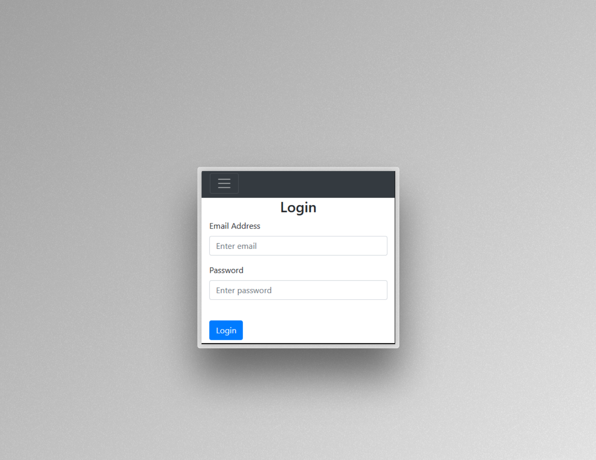
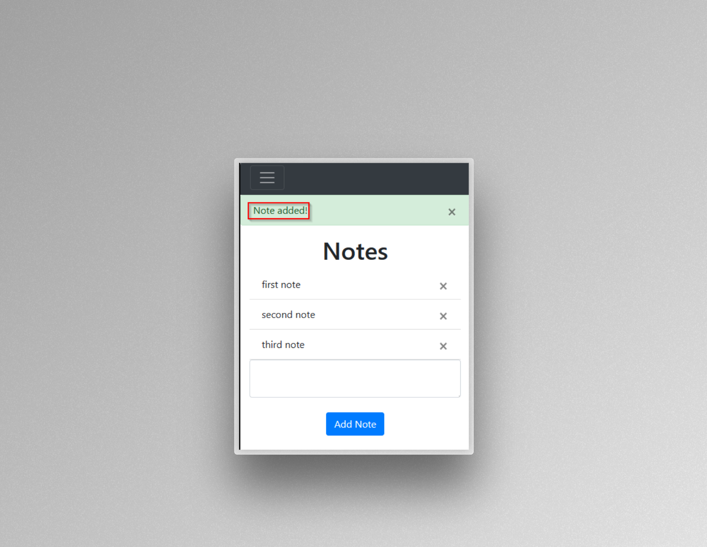
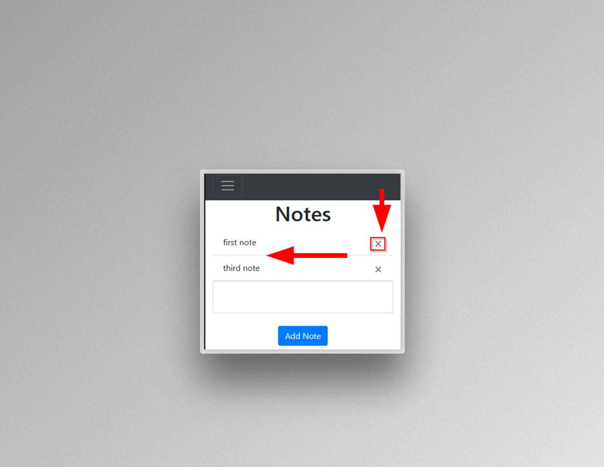

# Flask-Auth-App

## Python Application Authentication/Template

- Simple python program for authenticating and access log-in.
- Uses simple Python, HTML, CSS, and JavaScript.
- Utilizes Flask framework.
- Utilizes Bootstrap framework.
- Simple validation and database storing for passwords/username.
- Once validation access to Notepad with add and delete functionality.
- Developed first with the Mobile First methodology, then for desktop.
- Compatible with all mobile device and with a simple user interface.
- On going project, future update on UI for aesthetics and appeal.

